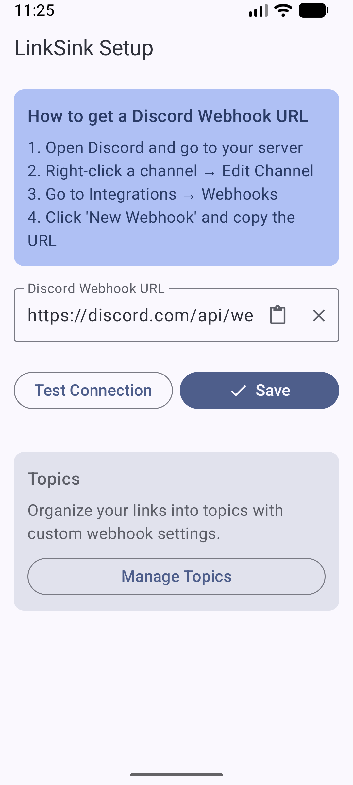
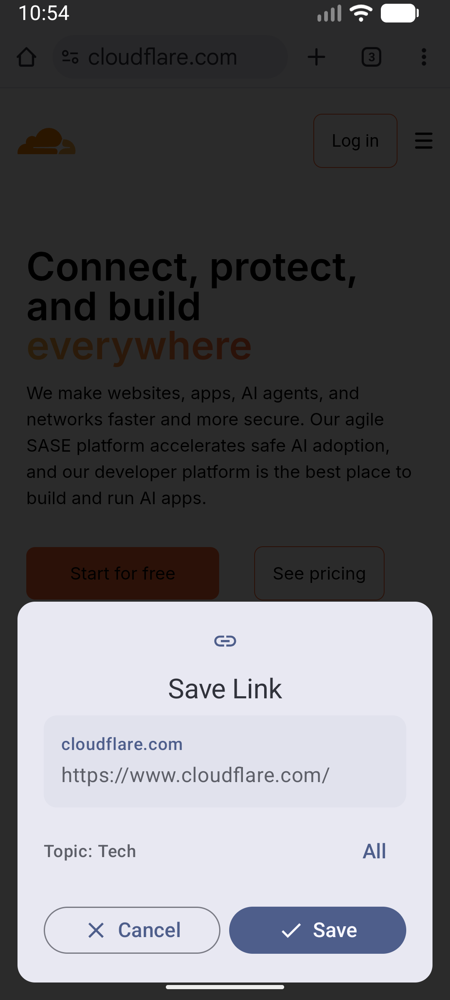
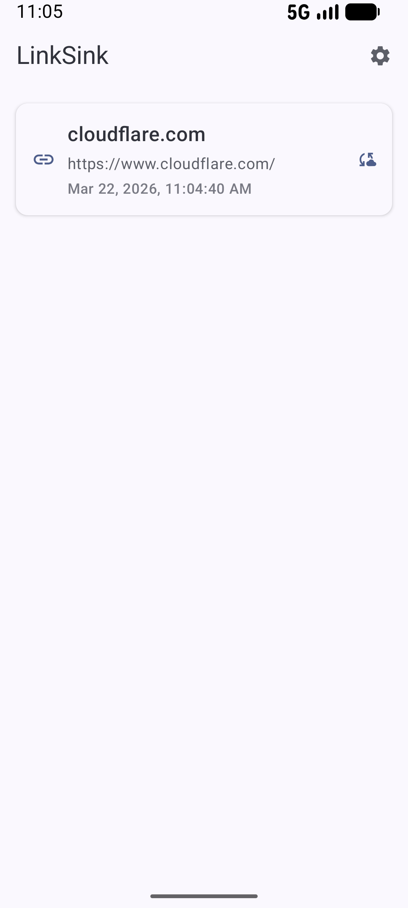

# LinkSink

Save and sync links with Discord webhooks.

LinkSink is a simple, privacy-focused Android app for saving links from any app and automatically syncing them to Discord via webhooks. Built with Kotlin and Jetpack Compose.

## Features

- **Share from anywhere** - Use Android's share menu to save links from any app
- **Topics** - Organize links into topics with custom webhook settings
- **Topic customization** - Add emoji, color, and ordering to topics
- **Discord sync** - Automatically post saved links to Discord channels via webhooks
- **Progressive UI** - Calm, scannable default view with progressive disclosure for search and filters
- **Consolidated Filters** - Topic and date selection in a single, unified filter entry point
- **Status Indicator System** - Clear icons and colors for Unread / Read / Archived status
- **Swipe-to-Unarchive** - Effortlessly manage archived items with updated swipe actions
- **Improved Sync Visibility** - Dedicated banners for pending syncs only when relevant
- **Search & Filter Refinements** - Collapsible search bar and smarter row layouts to reduce visual noise
- **Topic Editing** - Edit topic details via long-press on section headers
- **Architectural Polish** - Refactored codebase for better responsiveness and testability
- **Date filtering** - Filter links by Today, This Week, or This Month within the new filter sheet

### Topic Webhook Modes

Each topic can have its own webhook configuration:
- **Local Only** - Keep links private, no Discord sync
- **Use Global** - Use your default webhook URL
- **Custom** - Set a unique webhook per topic (great for different Discord channels)

## Screenshots

<p align="center">
  
  
  
</p>

## Installation

### F-Droid

Coming soon.

### GitHub Releases

Download the latest APK from the [Releases](../../releases) page.

### Obtainium

[](http://apps.obtainium.imranr.dev/redirect.html?r=obtainium://add/https://github.com/ghaith96/LinkSink)

### Build from Source

```bash
# Clone the repository
git clone https://github.com/your-username/linksink.git
cd linksink

# Build debug APK
./gradlew assembleDebug

# Install on connected device
./gradlew installDebug
```

**Requirements:**
- JDK 17
- Android SDK 36

## Setup

1. Install LinkSink on your Android device
2. Open the app and go to Settings
3. Create a Discord webhook in your desired channel:
   - Open Discord → Server Settings → Integrations → Webhooks
   - Create a new webhook and copy the URL
4. Paste the webhook URL in LinkSink settings
5. Test the connection
6. Start sharing links from any app!

## Architecture

LinkSink follows modern Android architecture patterns:

- **Kotlin** with Coroutines and Flow
- **Jetpack Compose** for declarative UI
- **Room** for local database
- **DataStore** for preferences
- **Ktor** for HTTP client
- **WorkManager** for background sync and reminders

## Requirements

- Android 10 (API 29) or higher
- Internet connection for Discord sync

## Contributing

Contributions are welcome! Please feel free to submit issues and pull requests.

## License

[MIT License](LICENSE)

---

**Perfect for:**
- Saving articles to read later
- Collecting research links
- Sharing discoveries with Discord communities
- Building a personal link archive
- Organizing links by project or interest
